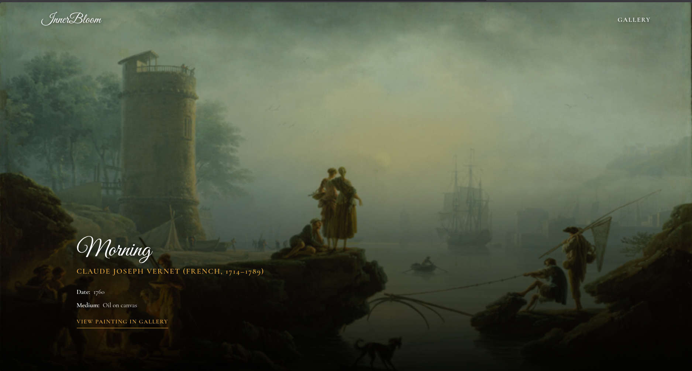

***InnerBloom*** **A curated gallery connecting users with the world's greatest art.**

---

InnerBloom is an immersive web application that serves as a digital art gallery. It offers a refined, minimal interface for users to explore collections of the world's most renowned paintings and artworks. 

## Data

All artwork metadata and historical context displayed within InnerBloom are fetched dynamically from the [Art Institute of Chicago API](https://api.artic.edu/). This integration ensures the platform delivers an accurate and visually rich experience.

---
